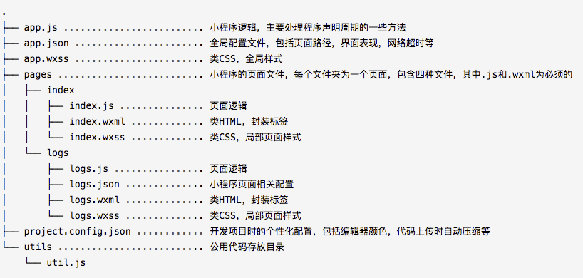

### 一、项目总结
1. **[已完成] 站内攻略高潮期问题总结**
  - 此次数据查询请求数据量过大，测试提出在弱网络环境下有可能请求超时。 解决：提供一个网络超时toast，提升用户体验。   
  - 红包雨预约需要每个整点都可预约，每个整点的预约事件id必须不同，用户每次预约都只是预约了某一整点的红包雨。日历组件无法实现规律性的每隔多少时间就提醒一次的预约。
2. **[进行中] 测试机管理小程序**
  - 描述：通过扫描每个手机专有的二维码借取/归还部门内测试机，提供个人手机及凹凸实验室测试机信息查询。
  - 进度： 50%，预计下周内完成
  - 问题：小程序提供的云数据库限制，设计的数据库结构效率较低

### 二、本周学习
1. 小程序原生开发
  - 目录结构说明
   
  - vscode插件辅助开发
  **live sass compile**：修改配置文件"extensionName": ".wxss"，将sass实时打包为wxss。同理如果是习惯用less的，可以用Easy WXLESS。   
  **vscode weapp api**：提供小程序API提示。   
  **vscode-wechat**：wxml和wxss语法高亮支持，本来支持本地预览，但是这个插件目前没有维护，预览功能有bug。   
  sublime可参考https://www.jianshu.com/p/ec0f7c936f23   
  - 注意点记录  
    - 小程序是数据驱动开发，无法操作DOM   
    - 小程序是微信的内部应用，无法获取到window/document   
    - 云函数上传部署速度很慢，如果在云函数内调用了云数据库，需要上传部署并安装依赖，速度就更慢了，建议本地测试好函数再部署上去。   
    - 一次只能对一个数据表进行增删改查，如果需要多表关联查询，需要分多次操作。   
    - 数据表读写操作权限只有四种，注意无法实现所有人均可写数据。   

2. 闯关模式游戏，画画为最主要的互动元素，由玩家画出主角/武器，游戏的开发比较简单，互动方式比较新颖。
  参考案例： http://zj.qq.com/money/ywl_game_halloween.htm   
     
  做了一个简单的demo，实现主体功能，画画并显示到界面上：   
  